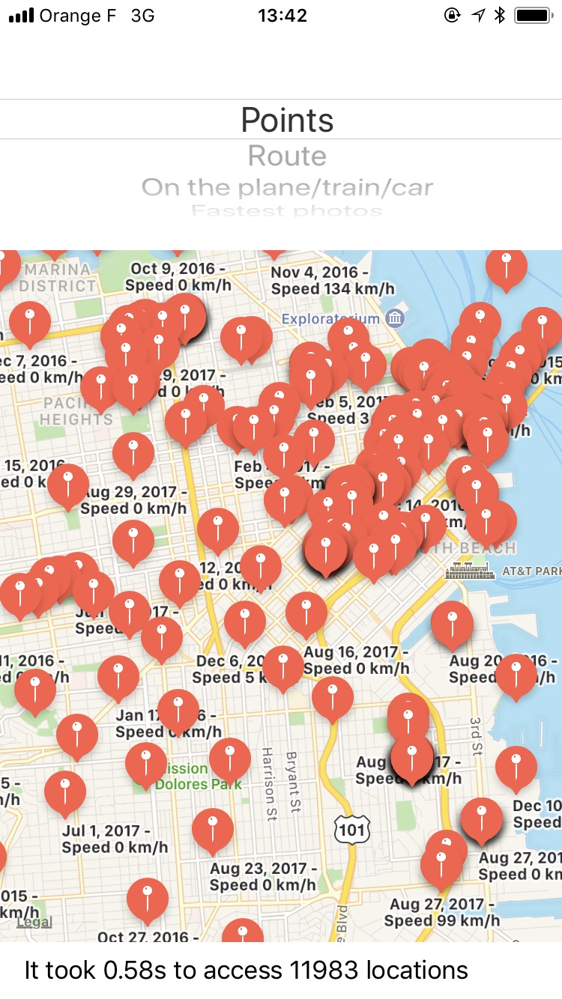
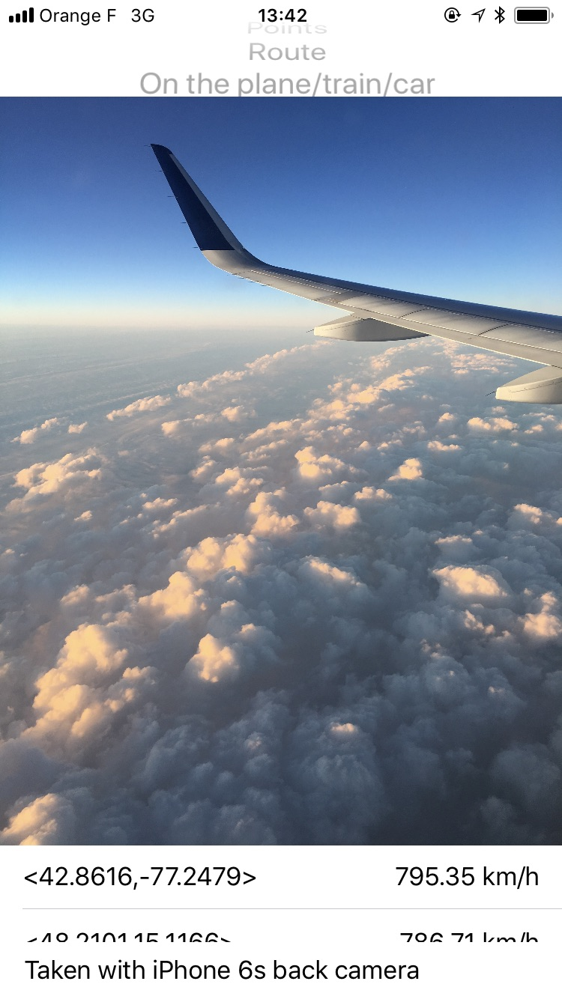
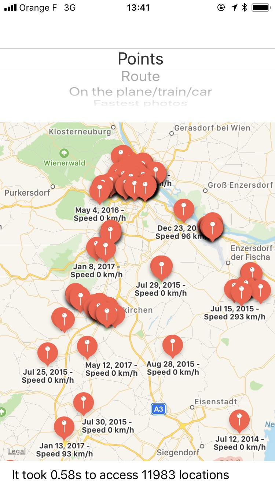

# `detect.location`

Does your iOS app have access to the image library of the user? Do you want to know all movements your users did over the last years, like what cities they visited, which iPhones they owned and how they travel? Do you want all that within under a second? Then this project is for you!

> Disclaimer: `detect.location` is not actually an SDK, it's a proof of concept to raise awareness of a privacy issue that can be abused by iOS apps. The goal isn't for apps to use this, but to let Apple know that we need better privacy controls for access to image metadata.

Permission Dialog | Map of locations | Rendering of Route
----|-----|-----
 |  | 

Find the "fastest" photos | Understand the user | Full access to raw photos
----|-----|-----
 |  | 

## What can you do with `detect.location`?

- Get a history of all cities, countries and places a person visited (assuming they took at least one picture)
- Find the physical location of the office the person works in, and with it the company name (based on where the person usually is during 9-5)
- Get a complete list of the user's photography devices (which iPhones, Android phones, cameras) and how long they had each device
- Use face recognization to understand who the user likes to hang out with and who their partner is. Is the user single?
- Understand where the user is coming from:
  - Did the user attend college? If so, which one?
  - Did the user recently move from the suburbs to the city?
  - Does the user spend a lot of time with their family?

## What's `detect.location`?

- iOS provides a native image picker, however it also allows app developers to access the **full** image library, with all its metadata
- By accessing the raw `PHAsset` (represents a picture or video) you also get access to the full image metadata, like the location and the speed in which the picture was taken. 
- In particular, an app can get the following data:
  - The exact location of each asset
  - The physical speed in which the picture/video was taken (how fast did the camera move)
  - The camera model
  - The exact date + time
  - The usual exif image metadata
- With this information, you can render a route on where the user was traveling over the last x years, even before they had an iPhone (assuming the camera had GPS)

## Proposal

There should be a clear separation of 

- `Saving a photo` (e.g. a 3rd party camera app wants to save a photo you just took)
- `Selecting a photo` (e.g. you want to upload an existing picture to Instagram)
- `Granting full access to the photo library` (e.g. Dropbox or Google Photos to backup your complete library)

Additionally the native image picker should be enforced by Apple, and apps that use their custom one will be rejected. 

Feel free to dupe [rdar://34610699](https://openradar.appspot.com/34610699) 👍

## Complexity

You might think it takes some work to write code that does all of the above. I built the initial prototype within under an hour, and then spend more time on some visualizations to show what you can do with the data.

Check out [DetectLocations/LocationPoint.m](https://github.com/KrauseFx/detect.location/blob/master/DetectLocations/LocationPoint.m) for the complete implementation of accessing all photos, accessing all locations is literally
```objective-c
PHFetchResult *photos = [PHAsset fetchAssetsWithMediaType:PHAssetMediaTypeImage options:nil];
    
for (PHAsset *asset in photos) {
    if ([asset location]) {
        // Access the full location, speed, full picture, camera model, etc. here
    }
}
```

## About the demo

If an image doesn't load when you tap on a marker / table cell, this means it's a video. A video player wasn't implemented as part of the demo.
